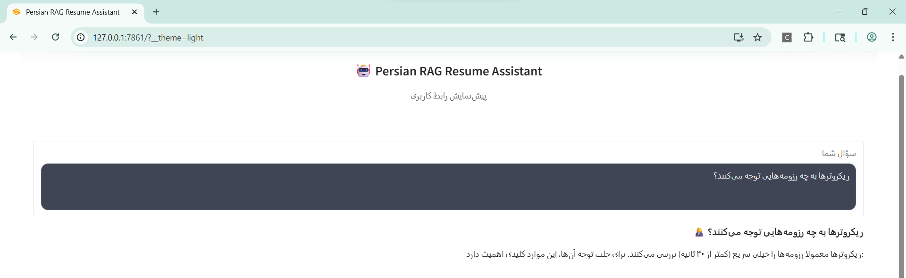
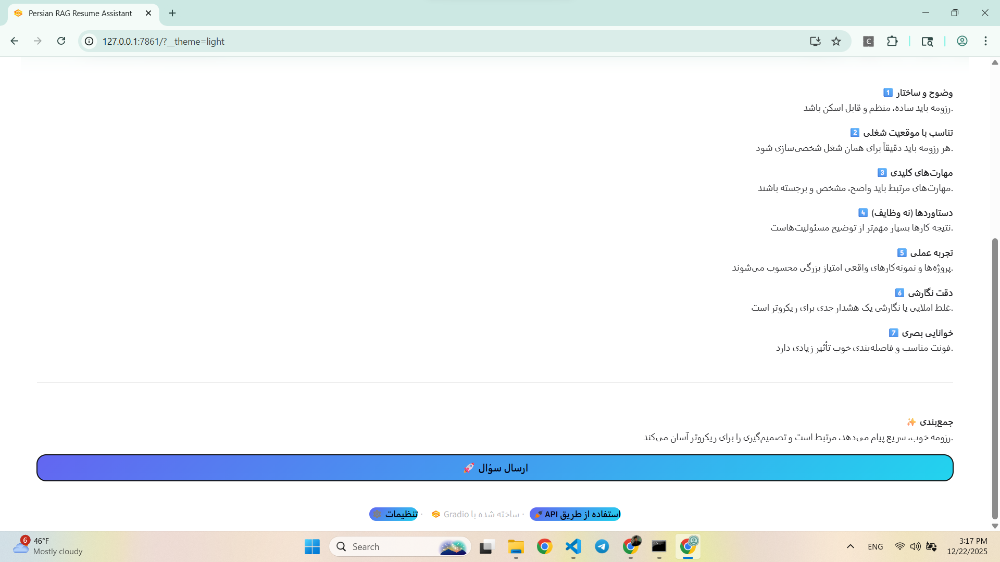

# Persian RAG System
**Domain-Specific Retrieval-Augmented Generation for Persian Technical Career & HR Use Cases**

---

-blue)


---

## Demo





---

## Quick Navigation

- [Overview](#overview)
- [Dataset](#dataset)
- [Retrieval--rag-pipeline](#retrieval--rag-pipeline)
- [Backend-api](#backend-api)
- [User-interface-ui](#user-interface-ui)
- [Setup--usage](#setup--usage)
- [Design-principles](#design-principles)
- [Use-cases](#use-cases)
- [Tech-stack](#tech-stack)
- [Contact](#contact)

---

## Key Features

- Persian-first RAG architecture
- Handcrafted, domain-specific dataset
- Explicit out-of-domain guardrails (cosine similarity threshold)
- Production-oriented FastAPI backend
- RTL Gradio UI with Dark & Glassmorphism design
- Modular and extensible codebase

---

## Architecture Snapshot

```text
User
 │
 ▼
Gradio UI (RTL)
 │
 ▼
FastAPI (/generate)
 │
 ├── Retriever (Sentence-Transformers + FAISS)
 │
 ├── Similarity Guardrail
 │
 └── Generator (OpenAI + RAG Prompt)
 │
 ▼
Final Answer (Grounded & Domain-Aware)
```

## Overview

**Persian RAG System** is a production-oriented, modular **Retrieval-Augmented Generation (RAG)** system designed specifically for the **Persian (Farsi)** language, with a strong focus on:

- Technical career paths
- Resume writing and evaluation
- Hiring and HR decision support for technical roles

### Problem Statement

Most existing RAG systems and LLM-based assistants are:
- Optimized for English
- Generic and non-domain-specific
- Weak in handling Persian technical and career-related queries
- Not suitable for real-world HR or recruitment workflows

This project addresses these gaps by providing a **domain-aware Persian RAG pipeline** that delivers **accurate, grounded, and role-specific answers** for technical job roles.

### Why RAG?

Relying solely on a generative model leads to:
- Hallucinations
- Inconsistent career advice
- Non-verifiable answers

Using **RAG** allows the system to:
- Ground responses in curated domain knowledge
- Improve factual accuracy and consistency
- Reject or guard against out-of-domain questions
- Scale safely in production environments

### Why Focus on Technical Resumes & Hiring?

Technical hiring requires:
- Precise role definitions
- Clear skill expectations
- Accurate differentiation between roles (e.g., ML Engineer vs LLM Engineer)

This system is built to support:
- Candidates writing better resumes
- HR teams evaluating technical profiles
- Domain-specific Q&A for technical career guidance

The entire architecture is designed with **production-readiness, extensibility, and clean separation of concerns** in mind.

---


## Dataset

### Dataset Design

- The dataset is **fully handcrafted**
- Carefully curated by domain knowledge rather than scraped data
- Optimized for **high-precision technical and HR-related responses**

### Domain Coverage

The dataset focuses on the following domains:

- `Data Scientist`
- `ML Engineer`
- `LLM Engineer`
- `NLP Engineer`
- `Backend Engineer`
- `MLOps Engineer`
- `resume_basics`

Each domain includes role-specific knowledge, expectations, skills, interview topics, and resume guidance.

### Data Format

- Data is structured in **conversational format** using `messages`
- Each sample follows a `system / user / assistant` structure, compatible with prompt-based LLM workflows and RAG context injection

Example:

```json
{
  "messages": [
    {
      "role": "system",
      "content": "You are a technical HR expert. You write professional, practical educational texts tailored to specific roles and categories."
    },
    {
      "role": "user",
      "content": "یک متن آموزشی حرفه‌ای درباره resume_basics بنویس."
    },
    {
      "role": "assistant",
      "content": "رزومه ابزار بازاریابی شخصی است. پیام باید واضح و متمرکز باشد. مخاطب HR است نه خودتان. تصمیم‌گیری را آسان کنید. این هدف نهایی است."
    }
  ]
}
```

### Preprocessing

Before use:
- Text normalization and cleaning are applied
- Persian-specific preprocessing is handled
- Documents are chunked and prepared for embedding

### Dataset Goal

To provide:
- Reliable
- Domain-accurate
- Non-generic
- Role-aware answers suitable for professional and hiring contexts

---

## Retrieval & RAG Pipeline

### Embedding Layer

- **Sentence-Transformers** are used for Persian text embeddings
- Optimized for semantic similarity in Persian technical language

### Vector Store

- **FAISS** is used for efficient vector similarity search
- Designed for scalability and low-latency retrieval

### Similarity & Guardrails

- **Cosine similarity** is used as the retrieval metric
- A configurable **similarity threshold** is applied to:
  - Detect out-of-domain questions
  - Prevent hallucinated answers
  - Enforce domain boundaries

### RAG Injection

- Retrieved documents are injected directly into the LLM prompt
- The generation step is fully grounded in retrieved context
- Ensures explainable and traceable responses

---

## Backend API

### Architecture

- Backend implemented using **FastAPI**
- Clean, modular, and production-ready structure
- Separation between:
  - API layer
  - Retrieval logic
  - Prompt construction
  - Model interaction

### Main Endpoint

`POST /generate`

#### Input
- User question (Persian text)

#### Output
- Generated response from the RAG system
- Guarded against out-of-domain queries

The API is designed to be:
- Extensible
- Deployable
- Suitable for real-world applications

---

## User Interface (UI)

### Technology

- Implemented using **Gradio**

### Design Features

- Fully **RTL (Right-to-Left)** for Persian language
- Dark theme with **Glassmorphism** design
- Clean and professional UI suitable for demos and real usage

### Execution Modes

- **Mock Mode**
  - UI runs without model or API
  - Useful for UI testing and demos
- **API-Connected Mode**
  - UI connects directly to the FastAPI backend
  - Full end-to-end RAG interaction

The UI is designed for:
- Demonstrations
- Presentations
- Practical usage by end users

---

## Project Structure
```text
PERSIAN_RAG_SYSTEM/
│
├── demo/
│   ├── demo1.png                 # UI / system demo screenshot
│   ├── demo2.png                 # UI / system demo screenshot
│
├── persian-rag-system/
│   │
│   ├── data/
│   │   ├── fine_tune_FINAL.jsonl # Final handcrafted domain dataset
│   │   ├── generated_dataset.jsonl # Generated conversational data
│   │   ├── bad_chunks.log        # Logged invalid or filtered chunks
│   │   └── preprocess.py         # Dataset preprocessing pipeline
│   │
│   ├── notebook/
│   │   └── persian_rag_system.ipynb  # Experiments, analysis, and prototyping
│   │
│   ├── src/
│   │   ├── __init__.py
│   │   ├── api.py                # FastAPI backend and /generate endpoint
│   │   ├── build_index.py        # FAISS index construction
│   │   ├── config.py             # Central configuration (paths, thresholds)
│   │   ├── generator.py          # LLM prompt construction and generation
│   │   └── retriever.py          # Embedding + FAISS retrieval logic
│   │
│   └── ui/
│       └── app.py                # Gradio-based RTL Persian UI
│
├── .gitignore
├── LICENSE
├── README.md
└── requirements.txt
```


## Setup & Usage

### 1. Clone Repository

```bash
git clone https://github.com/mehdighelich1379/persian-rag-system
cd PERSIAN_RAG_SYSTEM
```


### 2. Install Dependencies

```bash
pip install -r requirements.txt
```

### 3. Preprocess Dataset

```bash
python persian-rag-system/data/preprocess.py
```

### 4. Build FAISS Index

```bash
python persian-rag-system/src/build_index.py
```


### 5. Configure OpenAI API Key

Open the following file:

```text
persian-rag-system/src/generator.py
```


Find the following line and replace it with your own OpenAI API key:

```python
client = OpenAI(api_key="*****")
```

### 6. Run Backend API

From the repository root directory, run:

```bash
uvicorn persian-rag-system.src.api:app --reload
```

### 7. Run UI

In a new terminal window, run:

```bash
python persian-rag-system/ui/app.py
```

## Design Principles

- **Modular architecture**
  Each component (data processing, retrieval, generation, API, UI) is implemented as an independent module, making the system easy to maintain and extend.

- **Clear separation of responsibilities**
  Retrieval logic, prompt construction, model interaction, and API handling are cleanly separated to improve readability, testability, and scalability.

- **Centralized configuration management**
  Key parameters such as paths, similarity thresholds, and model settings are managed in a single configuration file to ensure consistency and simplify production deployment.


- **Explicit guardrails for out-of-domain queries**
  Cosine similarity thresholds are applied during retrieval to detect and safely reject questions that fall outside the supported domain, preventing hallucinated or unreliable responses.

- **Production-oriented design decisions**
  The system is built with real-world deployment in mind, emphasizing robustness, extensibility, clear interfaces, and maintainable code structure.

- **Domain-first dataset construction**
  The dataset is intentionally designed around well-defined technical roles and HR use cases, ensuring high relevance, precision, and consistency in generated answers.


## Use Cases

- **Technical resume assistant for Persian technical roles**
  Helps candidates create clear, role-specific, and professional resumes tailored to technical positions.

- **HR and recruitment assistant for role expectations and screening guidance**
  Supports HR teams with accurate role definitions, skill requirements, and interview preparation for technical hiring.

- **Domain-specific Persian Q&A system for career and hiring topics**
  Provides reliable, grounded answers to Persian questions related to technical careers and recruitment.

- **Reference architecture for building Persian RAG applications**
  Serves as a clean, production-ready template for developing domain-specific RAG systems in Persian.
## Tech Stack

- **Python**
- **Sentence-Transformers**
- **FAISS**
- **FastAPI**
- **Gradio**
- **OpenAI API**


## Contact

- **Email:** qelejkhanimehdi@gmail.com
- **LinkedIn:** https://www.linkedin.com/in/mehdighelich
